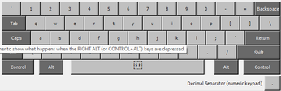
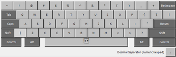
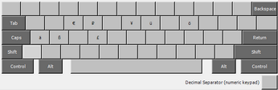
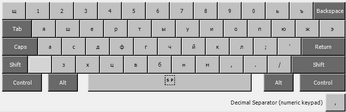
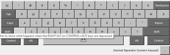
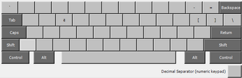
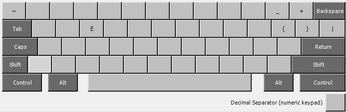
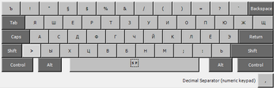

# Useful keyboard layouts for for Germany inhabitants (Windows)

You have US keyboard and want to be able typing ä,ö,ü,ß -- us-de-vX.Y.exe (umlauts can be typed by pressing right Alt)

You have US keyboard and want to type Russian letters -- ru-us-mn-vX.Y.exe (MNemonic layout)

You have DE keyboard and want to type Russian letters -- ru-de-mn-vX.Y.exe (MNemonic layout)

## Layouts description

### us-de

Layout principles are clear, press right alt to type umlauted German letter, nothing special.

Click on layout image to enlarge

### ru-us-mn

Layout means Russian letters over US keyboards, MNemonic, i.e. D becomes Д, try out, it's very intuitive.

Original research [here](https://medium.com/algonaut/russian-phonetic-keyboard-8e12238a6044)

Useful when you can't blind type, but your keys have only English (or English + Hebrew) letters

Click on layout image to enlarge

### ru-de-mn

Mnemonic layout for Russian over German (Deutsch) keyboard

Principles are the same as for US mnemonic layout

bear in mind that:

1. ä becomes э, ü is ю, ö = ё
1. German layout already actively uses right alt, in this layout r-alt restores german meaning of non-letter keys

Click on layout image to enlarge

## Download

[Releases](https://github.com/russiandesman/layouts_win/releases)

## Enjoy

